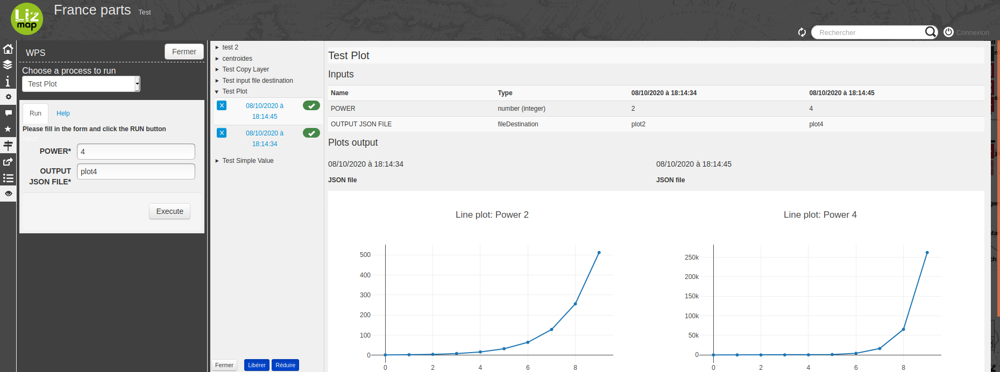

# Lizmap WPS Web Client

[](https://github.com/3liz/lizmap-wps-web-client-module/actions/workflows/lint.yml)
[](https://github.com/3liz/lizmap-wps-web-client-module/actions/workflows/release.yml)
[](https://packagist.org/packages/lizmap/lizmap-wps-web-client)

Lizmap WPS Web Client is a Lizmap module to add a WPS panel into [Lizmap Web Client](https://github.com/3liz/lizmap-web-client/).

This is an example showing the QGIS Processing Buffer algorithm, exposed as a WPS algorithm within Lizmap Web Client:




It's also providing another panel showing you the results which have been executed on the Lizmap instance.

## Installation

Since version 0.1.1, it is recommended to install the module
with [Composer](https://getcomposer.org), the package manager for PHP.
If you can't use it or if you are using Lizmap 3.3 or lower, use the manual way to
install the module (jump to the corresponding section below)

### Automatic installation with Composer and lizmap 3.4 or higher

* into `lizmap/my-packages`, create the file `composer.json` (if it doesn't exist)
  by copying the file `composer.json.dist`, and install the module with Composer:

```bash
cp -n lizmap/my-packages/composer.json.dist lizmap/my-packages/composer.json
composer require --working-dir=lizmap/my-packages "lizmap/lizmap-wps-web-client"
```

* If you are using Lizmap 3.6 or higher, execute

```bash
php lizmap/install/configurator.php wps
```

* Then for any version, execute Lizmap install scripts into `lizmap/install/` :

```bash
php lizmap/install/installer.php
./lizmap/install/clean_vartmp.sh
./lizmap/install/set_rights.sh
```

Go to the "Configuration" section.

### Manual installation into lizmap 3.3 or 3.4 without Composer

* Download the zip archive from the [release page into GitHub](https://github.com/3liz/lizmap-wps-web-client-module/releases).
* Extract files from the archive and copy the directory `wps` into `lizmap/lizmap-modules/` of Lizmap.
* Edit the file  `lizmap/var/config/localconfig.ini.php` to add this
  into the `[modules]` section

```ini
wps.access=2
```

* Then execute Lizmap install scripts into `lizmap/install/` :

```bash
php lizmap/install/installer.php
./lizmap/install/clean_vartmp.sh
./lizmap/install/set_rights.sh
```


## configuration

Add a section `[wps]` in your `localconfig.ini.php` and add the variables:

```ini
[wps]
wps_url=http://wps:8080
wps_rootDirectories=/projects/wps
redis_host=localhost
redis_port=6379
redis_key_prefix=lzmwps
ows_url=http://map:8080
restrict_to_config_projects=off
restrict_to_authenticated_users=off
enable_job_realm=off
admin_job_realm=
```

The WPS configuration:

* `wps_url` is the URL of the WPS service
* `wps_rootDirectories` is the path of the directories defined for the WPS Service MAP

The redis configuration for saving process status: uuid, INPUTS, OUTPUTS.

* `redis_host` the redis host to use
* `redis_port` the redis port to use
* `redis_key_prefix` the redis key prefix to use

The OWS proxy configuration:

* `ows_url` is the URL of the OWS service used by the WPS service

The availability of WPS algorithms in the Lizmap Web Client web maps

* `restrict_to_config_projects` the module is not enabled for projects without a json config for processes.
* `restrict_to_authenticated_users` the module is not enabled if the user is not authenticated.
* `enable_job_realm` enable job access control by associating a realm token to each job. Job realm will be build at user level.
* `admin_job_realm` administrator realm token. It allows bearer to bypass any other token.
