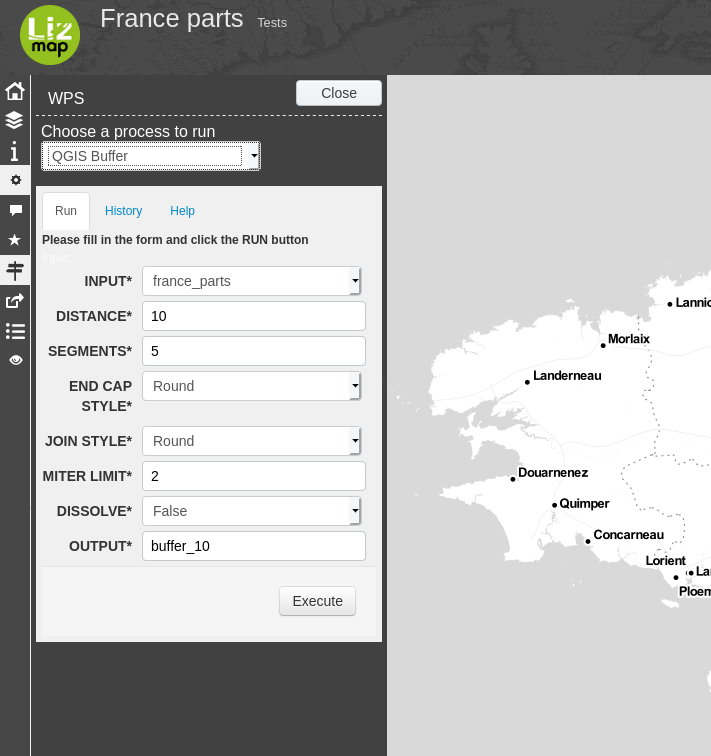

# Lizmap WPS Web Client

Lizmap WPS Web Client is a Lizmap module to add a WPS panel into [Lizmap Web Client](https://github.com/3liz/lizmap-web-client/).

This is an example showing the QGIS Processing Buffer algorithm, exposed as a WPS algorithm within Lizmap Web Client:



It's also providing another panel showing you the results which have been executed on the Lizmap instance.

## Installation

This module can be installed with PHP Composer and the file below needs to be update.

Add a section `wps` in your `localconfig.ini.php` and add the variables:

```ini
[wps]
wps_url=http://wps:8080
wps_rootDirectories=/projects/wps
redis_host=localhost
redis_port=6379
redis_key_prefix=lzmwps
ows_url=http://map:8080
```

The WPS configuration:

* `wps_url` is the URL of the WPS service
* `wps_rootDirectories` is the path of the directories defined for the WPS Service MAP 

The redis configuration for saving process status: uuid, INPUTS, OUTPUTS.

* `redis_host` the redis host to use
* `redis_port` the redis port to use
* `redis_key_prefix` the redis key prefix to use

The OWS proxy configuration:

* `ows_url` is the URL of the OWS service used by the WPS service
